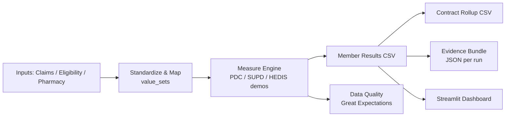
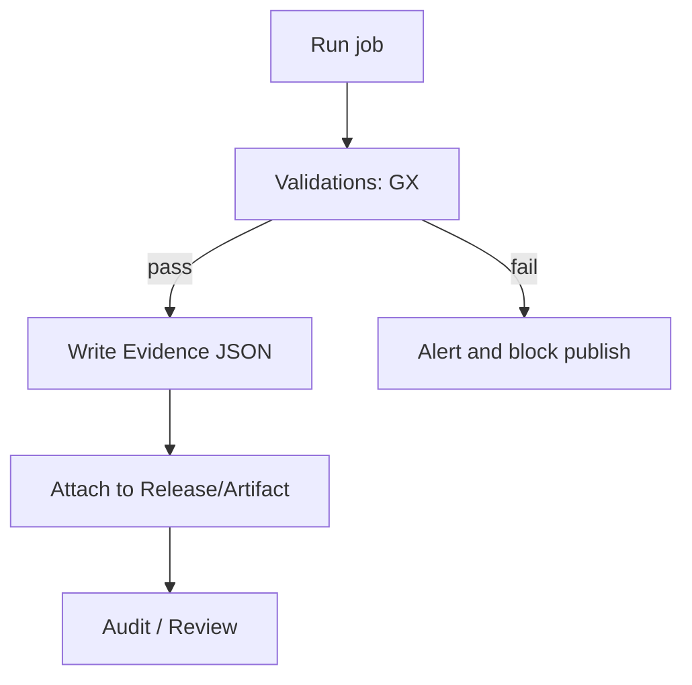
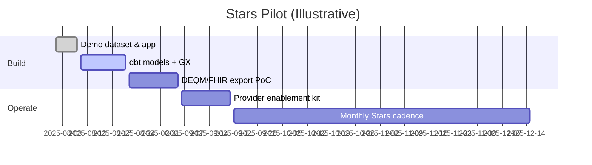
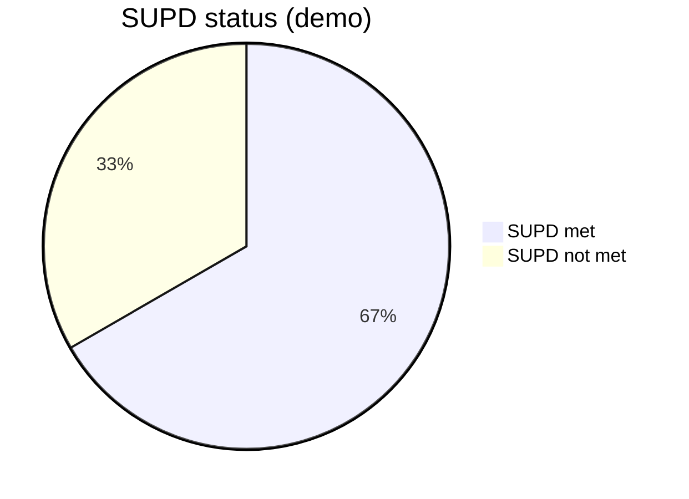

# QMTRY — Stars Dataset Builder (HEDIS® + Part D) ⭐🚀

> **Unlock the Galaxy of Healthcare Stars!** Build audit-ready datasets for HEDIS® and Part D measures in a flash — powering your path to top Star Ratings with synthetic demos, Streamlit visuals, and production-scale hooks! 🌟💥

[🌐 Explore QMTRY Magic](https://qmtry.ai/stars/) • Reach Out: stars@qmtry.com 📧

---

## Why This Repo Rocks Your World! 😎

CEOs and healthcare leaders, rejoice! This repo is your launchpad to **trusted, actionable Stars datasets** — from Part D adherence (PDC) to SUPD and beyond. Ship synthetic demos in minutes via Streamlit, then scale to dbt, Great Expectations, and FHIR/DEQM for real-world wins. No PHI risks, just pure value! 🎉

---

## Table of Contents (Your Stellar Roadmap)

- [Executive Summary (Why CEOs Care)](#executive-summary-why-ceos-care)  
- [KPI Quick Looks](#kpi-quick-looks)  
- [What's Inside (Scope)](#whats-inside-scope)  
- [Architecture (The Cosmic Flow)](#architecture-the-cosmic-flow)  
- [Quickstart (Blast Off in Minutes!)](#quickstart-blast-off-in-minutes)  
- [Data Contracts (Your Input Specs)](#data-contracts-your-input-specs)  
- [Measure Notes (The Fine Details)](#measure-notes-the-fine-details)  
- [Governance Workflow (Audit-Proof Magic)](#governance-workflow-audit-proof-magic)  
- [Delivery Plan (Gantt: Your Timeline to Victory)](#delivery-plan-gantt-your-timeline-to-victory)  
- [Repository Layout (The Folder Galaxy)](#repository-layout-the-folder-galaxy)  
- [Bonus SUPD Status Pie (Demo Delight)](#bonus-supd-status-pie-demo-delight)  
- [Next Steps & Enhancements](#next-steps--enhancements)  
- [License](#license)

---

## Executive Summary (Why CEOs Care) 💼🌟

- **Direct Line to Star Ratings:** Zero in on Part D adherence (PDC) and SUPD, with easy hooks for HEDIS clinical measures — boost your scores, wow CMS!  
- **Provider-Actionable Outputs:** Member-level flags and contract rollups to fuel year-round gap closure — empower your teams to act fast!  
- **Audit Discipline Baked In:** Evidence JSON bundles + data quality checks for rock-solid compliance reviews. No surprises!  
- **Digital-Quality Ready:** ECDS structure today; DEQM/FHIR exports tomorrow — future-proof your data exchange with providers.  

**Outcome:** A clean, audit-ready dataset payers and providers can trust:  
- `output_demo/measure_member_results.csv` — Member-level flags & scores (PDC, SUPD, etc.)  
- `output_demo/measure_contract_rollup.csv` — Contract-level rollups for exec reporting  

This repo ships with synthetic demo data and a Streamlit app — see value in minutes, scale to production with dbt, Great Expectations, and FHIR/DEQM exports! 🚀

---

## KPI Quick Looks 📊

| Domain   | Example KPI                  | Target                  |
|----------|------------------------------|-------------------------|
| Part D   | PDC ≥ 80% (Diabetes)         | ≥ 0.80                 |
| Part D   | SUPD rate                    | ↑ quarter-over-quarter |
| Ops      | Evidence bundle completeness | 100% of runs           |
| Data Quality | Critical validations passing | 100%                  |

---

## What's Inside (Scope) 🔍

- **HEDIS / Part D Foundations:** Demo logic for PDC and SUPD with value-set stubs — swap in your licensed sources for the real deal!  
- **Interoperability:** Placeholders for DEQM/FHIR bundles; ECDS-friendly structure to play nice with modern systems.  
- **Governance:** Per-run Evidence Bundle with time windows, row counts, and code hashes — audit-ready from day one!  
- **Production Runway:** dbt project + Great Expectations hooks; keep demos simple, explode into scale when ready.  

---

## Architecture (The Cosmic Flow) 🛠️

Watch your data transform from raw inputs to stellar outputs! Here's the high-level architecture:



---

## Quickstart (Blast Off in Minutes!) 🚀

Fire up the demo with synthetic data — no setup headaches!

```bash
# 1) Environment
python -m venv .venv && source .venv/bin/activate
pip install -r requirements.txt

# 2) Build demo outputs (synthetic data)
python scripts/build_stars_dataset.py --start 2024-01-01 --end 2024-12-31

# 3) Explore visuals
streamlit run streamlit/app.py
```

Outputs land in `output_demo/`:  
- `measure_member_results.csv` → member_id, contract_id, pdc_diabetes, pdc_statin, supd_flag  
- `measure_contract_rollup.csv` → contract_id, members, pdc_diabetes_avg, pdc_statin_avg, supd_rate  

---

## Data Contracts (Your Input Specs) 📑

**pharmacy_claims.csv**  
- member_id, fill_date (YYYY-MM-DD), days_supply (int), drug_class (statin|diabetes|...)  

**eligibility.csv**  
- member_id, contract_id, dob, gender, effective_date, term_date  

Replace with your production schemas and map value sets under `/value_sets`.

---

## Measure Notes (The Fine Details) 📝

- **PDC (Proportion of Days Covered):** Days covered by fills / days in period (per drug class).  
- **SUPD:** Demo rule: ≥2 diabetes fills and ≥1 statin fill within the window.  
- Thresholds like PDC ≥ 80% are for illustration — align to licensed specs in production!  

---

## Governance Workflow (Audit-Proof Magic) 🛡️

Keep everything compliant and traceable with this workflow:



---

## Delivery Plan (Gantt: Your Timeline to Victory) ⏰

Here's an illustrative Gantt for your Stars pilot — adjust as needed for your conquest!



---

## Repository Layout (The Folder Galaxy) 🗂️

```
.
├── README.md
├── CITATIONS.md
├── requirements.txt
├── configs/stars.yml
├── data_demo/
│   ├── eligibility.csv
│   └── pharmacy_claims.csv
├── scripts/
│   └── build_stars_dataset.py
├── output_demo/
│   ├── measure_member_results.csv
│   └── measure_contract_rollup.csv
├── streamlit/app.py
├── dbt/ (placeholder)
├── value_sets/ (stubs; replace with licensed sources)
└── evidence/
    RUN_YYYY-MM-DD.json
```

---

## Bonus SUPD Status Pie (Demo Delight) 🥧

Peek at a sample SUPD breakdown from the demo data:



---

## Next Steps & Enhancements 🚀

- Add DEQM export for select measures  
- dbt lineage docs + CI checks  

Scale up and dominate those Star Ratings! If you need custom tweaks, hit us up. 🌌

---

## License 📄

MIT — Free to fork, build, and shine! ⭐
